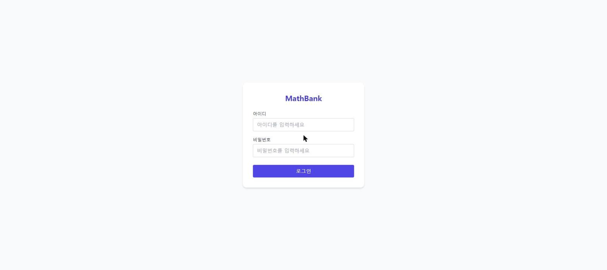
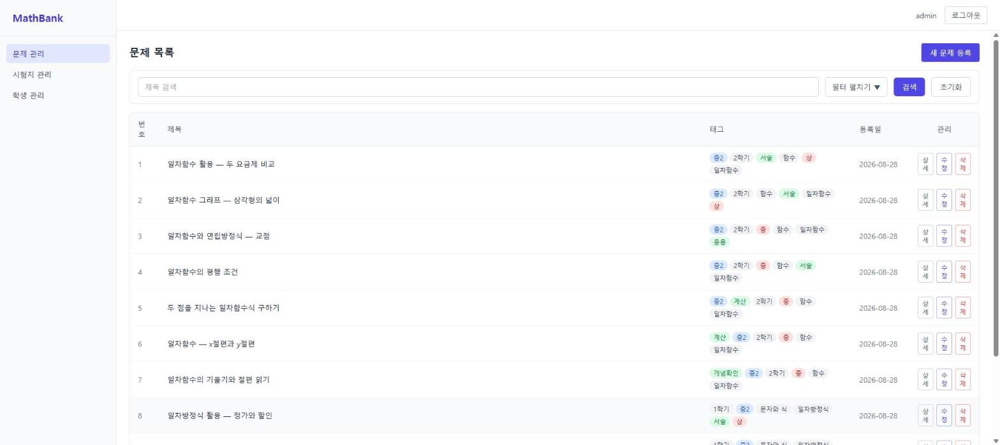
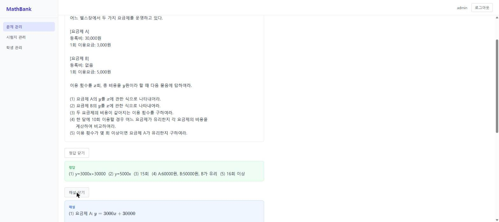
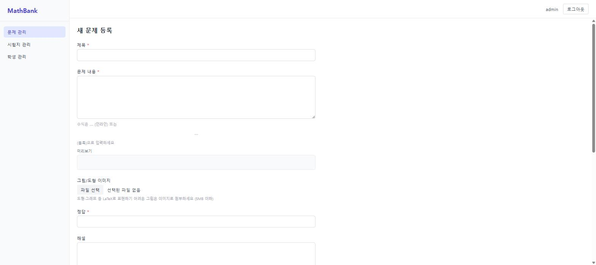
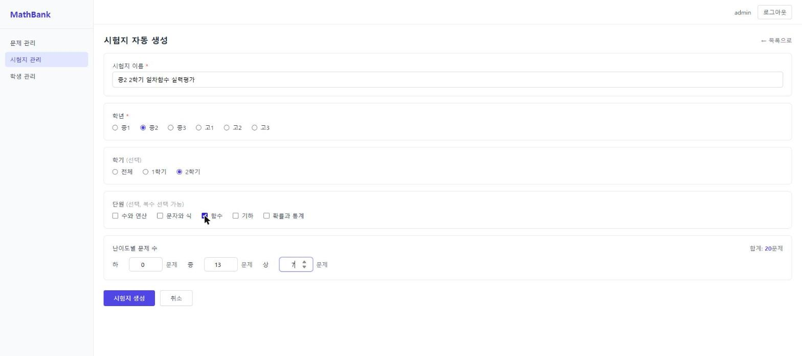
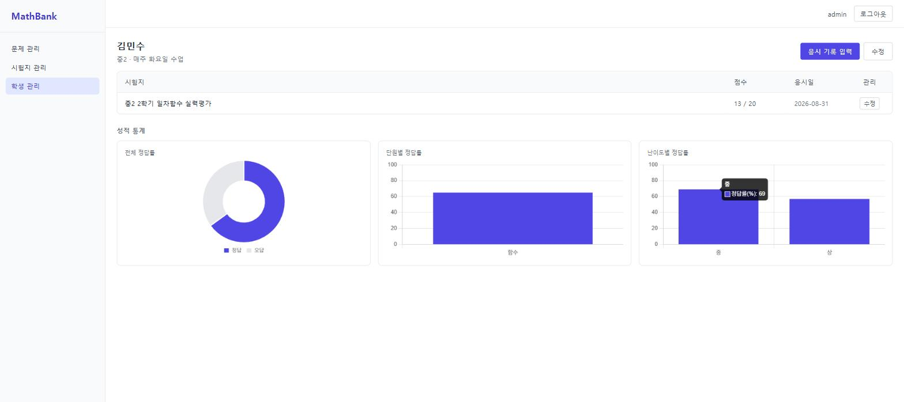
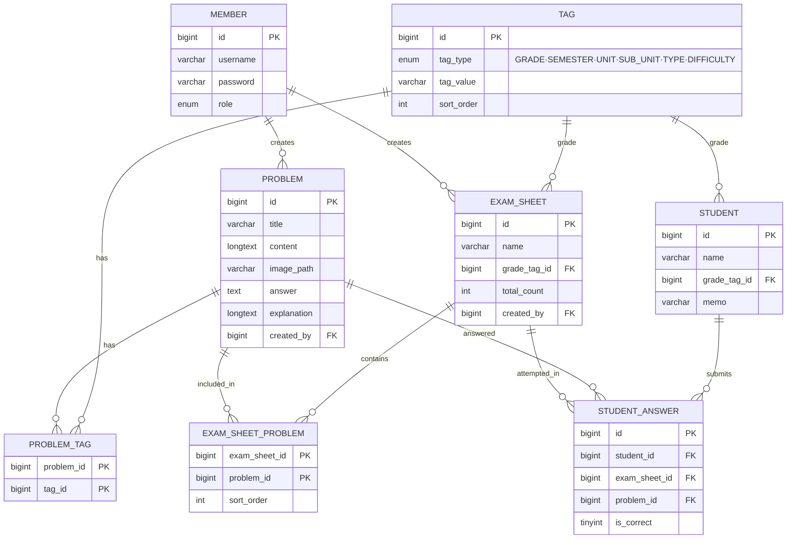

# 수학 문제은행 + 시험지 자동 생성 시스템

학년·단원·유형·난이도 6축 태그로 문제를 분류하고, 조건만 입력하면 시험지를 자동 생성해 PDF로 출력하는 시스템입니다.

**🔗 배포 링크: http://34.53.95.30**  (테스트 계정: `admin` / 문의 시 제공)

---

## 왜 만들었나

강사 시절 매주 시험지를 만들었습니다. "중2 1학기 일차함수만 모아서 중상 난이도로 20문제" 같은 요구가 반복되는데, 매번 hwp 파일에서 문제를 직접 골라 복붙하고 있었습니다.

그때 자동화하면 되겠다고 생각만 했던 것을 이번에 직접 만들었습니다.

핵심은 태그 체계입니다. 학년·학기·대단원·소단원·유형·난이도라는 6축 분류는 수학교육과정을 직접 이수하고 현장에서 가르쳐본 사람이 아니면 정확하게 설계하기 어려운 구조입니다. 실무의 코드 분류 체계와 원리는 같지만, 도메인 지식의 깊이가 다른 부분이라고 생각합니다.

---

## 스크린샷

| | |
|---|---|
|  로그인 |  문제 목록 — 6축 태그 필터 |
|  문제 상세 — KaTeX 수식 렌더링 + 정답/해설 |  문제 등록 — 도형/그래프 이미지 첨부 |
|  시험지 자동 생성 — 조건·난이도 분포 입력 |  시험지 상세 — PDF 출력 |
|  학생 성적 통계 — Chart.js | |

---

## 주요 기능

- **문제 관리**: LaTeX 수식(KaTeX 렌더링) + 도형/그래프 이미지 첨부, 6축 태그(학년/학기/대단원/소단원/유형/난이도) 분류
- **다중 태그 + 키워드 검색**: MyBatis 동적 쿼리로 조건 조합
- **시험지 자동 생성**: 학년·학기·단원·난이도 분포(하/중/상 문항 수)를 입력하면 조건에 맞는 문제 풀에서 가중 랜덤 선택 + 셔플
- **PDF 출력**: 문제지/답안지 분리, 페이지 번호(N/M), 한글 폰트(나눔고딕) 임베딩, 문제 이미지 포함
- **학생 관리 + 응시 기록**: 시험지별 문항 단위로 정답 여부 입력
- **성적 통계**: 전체/단원별/난이도별 정답률을 Chart.js로 시각화
- **AWS 배포 + CI/CD**: EC2 + RDS, GitHub Actions로 push 시 자동 빌드·배포

---

## 기술 스택

| 영역 | 기술 |
|---|---|
| Backend | Java 17, Spring Boot 4.x, MyBatis, Spring Security |
| DB | MariaDB (로컬), AWS RDS for MariaDB (운영) |
| Frontend | Thymeleaf + Tailwind CSS |
| 수식 렌더링 | KaTeX |
| PDF 출력 | OpenPDF + 한글 폰트(나눔고딕) 임베딩 |
| 차트 | Chart.js |
| 인프라 | AWS EC2 (Amazon Linux 2023) + RDS, GitHub Actions |

**패키지 구조** — 모놀리식으로 구현하되, 도메인 경계는 패키지 수준으로 미리 분리 (추후 MSA 전환 대비)

```
src/main/java/com/mathbank/
  ├── auth/        인증
  ├── problem/     문제·태그
  ├── examsheet/   시험지 생성·PDF
  ├── attempt/     학생·응시·통계
  └── common/      공통 설정·유틸
```

---

## ERD



---

## 로컬 실행

```bash
git clone https://github.com/SmileHamster/mathbank.git
cd mathbank

# MariaDB에 스키마 + 태그 데이터 적용
mysql -u root -p mathbank < src/main/resources/sql/schema.sql
# (시드 문제 100여 개를 원하면 추가로)
mysql -u root -p mathbank < src/main/resources/sql/sample_problems.sql
mysql -u root -p mathbank < src/main/resources/sql/sample_problem_tags.sql
mysql -u root -p mathbank < src/main/resources/sql/sample_중2_pdf_test.sql
mysql -u root -p mathbank < src/main/resources/sql/sample_중2_100_problems.sql

./mvnw spring-boot:run
```

`src/main/resources/application.yml`에서 DB 접속 정보를 로컬 환경에 맞게 수정하세요. 기본 포트는 8090이며, 최초 기동 시 `admin` / `admin1234` 계정이 자동 생성됩니다.

---

## 배포

Google Cloud Compute Engine Always Free VM(`e2-micro`) 한 대에 애플리케이션과 MariaDB를 함께 운영합니다. `main` 브랜치에 push하면 GitHub Actions가 Maven 빌드 → VM으로 jar 전송 → systemd 서비스 재시작까지 자동으로 처리합니다. 인프라 구성과 트러블슈팅 과정은 [DEPLOY.md](DEPLOY.md)에 정리했습니다.

> 처음엔 AWS EC2 + RDS로 배포했습니다. AWS 프리티어는 12개월 한정이라, 장기간 켜둘 포트폴리오 프로젝트에는 영구 무료인 GCP Always Free가 더 맞다고 판단해 옮겼습니다 (RDS 대신 같은 VM에 MariaDB를 직접 설치).

**배포 과정에서 겪은 문제들**
- 80번 포트를 `setcap`으로 열려다 JVM이 깨짐 → glibc secure-execution mode가 `$ORIGIN` 상대경로 라이브러리 탐색을 막아버려서 `libjli.so`를 못 찾는 것이 원인. iptables `80→8080` 리다이렉트로 전환 (AWS·GCP 공통)
- RDS가 TLS 연결을 강제(`require_secure_transport=ON`)해서 JDBC URL에 `sslMode=trust` 필요 — GCP 이전 후에는 DB가 로컬(`localhost`)이라 이 문제 자체가 사라짐
- 로컬 개발 DB의 우연한 auto_increment 값(태그 id 76~100 등)을 시드 SQL에 하드코딩해뒀던 게 새 DB에선 FK 에러로 깨짐 → `(tag_type, tag_value)` 조회 기반으로 전환해 환경에 무관하게 동작하도록 수정
- 관리자 계정이 재시작마다 `admin1234`로 초기화되던 로직을 발견 — 최초 1회만 생성하고 초기 비밀번호는 환경변수(`ADMIN_INIT_PASSWORD`)로 주입하도록 수정
- GCP는 인스턴스 생성 시 키페어를 자동으로 안 심어줘서 메타데이터 SSH 키를 직접 등록해야 했는데, OS Login이 켜져있으면 그 키가 통째로 무시됨 — 인스턴스 메타데이터에서 OS Login을 끄고 재부팅해 해결
- AWS `ec2-user`처럼 GCP도 최초 생성된 계정을 자동으로 `google-sudoers` 그룹(비밀번호 없는 전체 sudo)에 넣어준다는 걸 확인 — CI 배포용으로 별도 scoped sudoers를 만들어뒀지만, 사실상 이 기본 그룹 권한이 더 넓음

---

## 기술적 의사결정

| 결정 | 이유 |
|------|------|
| Thymeleaf 선택 | JSP 대비 미래지향적, React 대비 짧은 개발 기간에 적합 |
| OpenPDF 선택 | iText 라이선스 이슈(AGPL) 회피, 한글 폰트 임베딩 지원 |
| KaTeX 선택 | MathJax 대비 가볍고 빠름, 서버 사이드 렌더링 불필요 |
| 태그 6축 설계 | 수학교육과정 분류 체계를 직접 인용, 현장 강사 경험 기반 |
| 모놀리식 선택 | 완성 우선, 도메인 경계는 패키지 수준으로 미리 분리 |
| PDF 수식 렌더링 — 텍스트 치환 선택 | KaTeX는 JS 라이브러리라 JVM에서 직접 실행 불가(브라우저-서버 런타임 경계). `latexToText()` 정규식으로 LaTeX → 유니코드 기호 변환. 대안인 headless Chrome 렌더링은 구현 비용 대비 범위 초과로 판단 |
| 문제 이미지 — 로컬 디스크 저장 | 도형·그래프 등 LaTeX로 표현하기 힘든 그림은 파일 업로드로 첨부. S3 대신 EC2 로컬 디스크(EBS라 재부팅에도 보존)로 단순화 |
| 페이지 번호 N/M — 2-pass 방식 | `PdfPageEventHelper.onEndPage()`에서 현재 페이지 기록 + `PdfTemplate` 플레이스홀더 삽입, `onCloseDocument()`에서 전체 페이지 수를 역으로 채움. 순방향 출력만으로는 총 페이지를 미리 알 수 없어 2-pass가 필수 |
| 배포 시 80포트 — iptables 리다이렉트 | `setcap`은 JVM의 라이브러리 탐색을 깨뜨려서(위 "배포에서 겪은 문제" 참고) 대신 커널 레벨 NAT 리다이렉트 사용 |

> 4주 단위 개발 계획, Week별 상세 작업 목록은 [PLANNING.md](PLANNING.md)에서 확인할 수 있습니다.

---

## 다음 계획

같은 도메인을 MSA + eGov 5.0으로 재구성하는 2호 프로젝트를 계획하고 있으며, 그것을 염두에 두고 1호에서도 패키지를 서비스 경계(`auth` / `problem` / `examsheet` / `attempt`) 기준으로 미리 분리해 두었습니다.
